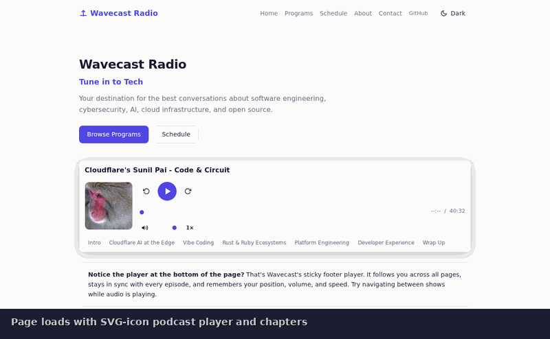

# Wavecast

[](https://github.com/adurrr/wavecast/releases)
[](https://github.com/adurrr/wavecast/blob/main/LICENSE)
[](https://github.com/adurrr/wavecast/actions)
[](https://github.com/adurrr/wavecast/stargazers)

<p align="center">
  
</p>

A persistent podcast/radio audio player for Hugo: drop `<podcast-player>` into any page with a single shortcode. Supports **local files**, **AzuraCast** radio streams, and **iVoox** episodes. Works as a **Hugo module** and as a **Hugo theme**.

**[Live demo](https://adurrr.github.io/wavecast/)** | **[Documentation](https://adurrr.github.io/wavecast/docs/)**

---

## How It Works

Wavecast provides two custom Web Components that work together:

| Component | Where | What it does |
|-----------|-------|-------------|
| `<podcast-player>` | Inline (in your content) | Play/pause, skip, seek, volume, chapters, poster |
| `<podcast-footer>` | Sticky footer | Persistent player bar that follows you across every page |

Both components are bidirectionally synced: pausing the footer pauses all inline players, and vice versa. Only one audio source plays at a time. Position, volume, mute, and speed survive page navigation.

## Features

- **Web Component** with Shadow DOM: framework-agnostic, works anywhere
- **Inline player**: play/pause, skip +-15s, seekable progress bar, volume slider, mute, playback rate (0.5x-2x)
- **Sticky footer player**: cover art, track name, skip, play/pause, progress bar, volume, mute, speed, close
- **Bidirectional sync** between inline and footer players
- **Single-stream**: playing a new source stops the previous one automatically
- **Chapters**: timestamp-labelled navigation chips
- **Poster and description**: cover image with responsive sizing, Markdown-rendered show notes
- **Source adapters**: local files, AzuraCast, iVoox (with auto-detection)
- **Navigation persistence**: survives Turbolinks, Turbo, htmx, and vanilla page loads
- **CSS custom properties** for light/dark themes, responsive on mobile
- **`::part()` selectors**: style individual Shadow DOM elements from outside
- **Keyboard shortcuts**: Space (play/pause), Left/Right (skip), M (mute)
- **Media Session API**: integrates with OS media controls
- **Podcast RSS feed**: iTunes-compatible feed generation from Hugo content
- **Accessible**: ARIA labels, `:focus-visible` rings, semantic controls

---

## Quick Start

```markdown

```

Place audio files in your Hugo project's `assets/` directory and use `src="episodes/my-episode.mp3"` for local playback.

Add the sticky footer to `layouts/_default/baseof.html` just before `</body>`:

```html
<podcast-footer id="podcast-footer"
  data-turbolinks-permanent data-turbo-permanent hx-preserve>
</podcast-footer>
```

---

## Installation

**Prerequisites**: Hugo v0.146.0+, Go 1.23+ (module install only)

**Theme** (recommended for most sites):
```bash
git clone git@github.com:adurrr/wavecast.git themes/wavecast
```
```toml
# hugo.toml
theme = "wavecast"
```

**Module** (for multi-module sites):
```bash
hugo mod get github.com/adurrr/wavecast
```
```toml
# hugo.toml
[module]
  [[module.imports]]
    path = "github.com/adurrr/wavecast"
```

**Run the demo**:
```bash
git clone git@github.com:adurrr/wavecast.git
cd wavecast/exampleSite
hugo server --port 1313
```

---

## Documentation

Full documentation is built into the [live demo site](https://adurrr.github.io/wavecast/docs/) and the example site (run locally to browse). Each page includes working code examples:

| Page | Covers |
|------|--------|
| [Welcome](https://adurrr.github.io/wavecast/docs/) | Overview, features, navigation |
| [Installation](https://adurrr.github.io/wavecast/docs/installation/) | Theme vs module, version pinning |
| [Getting Started](https://adurrr.github.io/wavecast/docs/getting-started/) | First episode, parameters |
| [Configuration](https://adurrr.github.io/wavecast/docs/configuration/) | Global defaults, CSS properties, `::part()` selectors |
| [Homepage Setup](https://adurrr.github.io/wavecast/docs/homepage-setup/) | Footer player, framework attributes |
| [Utility Shortcodes](https://adurrr.github.io/wavecast/docs/shortcodes/) | Admonitions, buttons, figures, tabs, galleries |
| [Front Matter](https://adurrr.github.io/wavecast/docs/front-matter/) | Audio fields, podcast RSS fields |
| [Advanced](https://adurrr.github.io/wavecast/docs/advanced/) | Source adapters, events, persistence, troubleshooting |

The docs include a Spanish translation at `/es/docs/`.

---

## Development

### Project structure

```
assets/
  css/podcast-player.css    # External stylesheet (light theme, responsive, focus-visible)
  js/podcast-player.js      # Web Component + source adapters + persistence (~1790 lines)
  js/sources.js             # Re-exports for test imports
  demo/demo-audio.wav       # Demo audio file for the example site
layouts/
  _default/
    rss.xml                   # Podcast RSS template (auto-detects podcast config)
  _shortcodes/
    podcast-player.html       # Hugo shortcode template
tests/
  hugo/                     # Go integration tests (builds Hugo sites per case)
  js/                       # Vitest unit tests
  e2e/                      # Playwright E2E tests
exampleSite/                # Runnable demo site with built-in documentation
theme.toml                  # Hugo theme manifest
```

### Test suites

```bash
npm test                          # JS unit tests (Vitest + jsdom)
go test -v -timeout 120s ./tests/hugo/...  # Go integration tests
npm run test:e2e                  # E2E tests (Playwright + Hugo server)
npm test && go test ./tests/hugo/... && npm run test:e2e  # All tests
```

### Adding a new source adapter

1. Create a new class in `assets/js/podcast-player.js` implementing `fetchStreamUrl()` and/or `fetchMetadata()`
2. Register it in the `sourceAdapters` map
3. Add auto-detection rules in `_detectSource()`
4. Write JS unit tests in `tests/js/` and E2E tests in `tests/e2e/`
5. Run all three test suites

---

## License

AGPLv3
